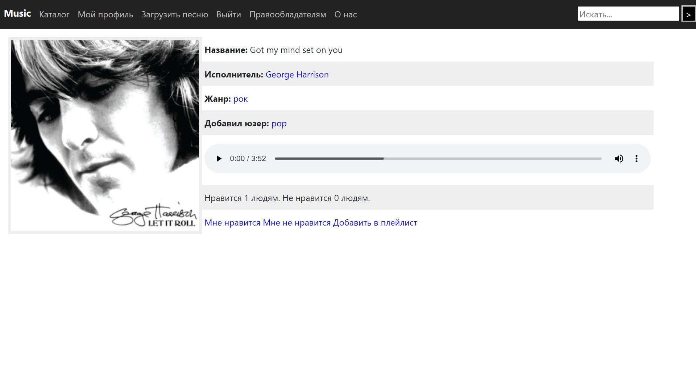

# Flask music project

Flask music project is a project of a community-driven music
database developed in April 2022 as an assignment for Yandex 
Lyceum's "Basics of industrial programming" course.
Its tech stack includes libraries provided by the 
[Flask](https://flask.palletsprojects.com/en/stable/) framework
as well as the ORM library [SQLAlchemy](https://www.sqlalchemy.org/).
No production server is running this application as of March 2025.

## Running on a development server

* Clone this GitHub repository
* Install all dependencies as stated in [requirements.txt](requirements.txt)
* Run [main.py](main.py)

## Features

* Song search
* Artist search
* User account management
* Adding a song to a user's playlist
* Rating songs with likes and dislikes
* Playing and downloading the songs
* Downloading all songs of an artist

## Legal notice

This web application was made for educational purposes and is not liable
for the material uploaded by the users.

## Project structure

* [data](data) contains table descriptions for the database model.
* [db](db) contains the database file.
* [static](static) consists of several subfolders:
  * [artists_img](static/artists_img) is used for storing the pictures
  of artists.
  * [css](static/css) contains the project's stylesheet.
  * [img](static/img) is used by the old version of the website,
    left as an Easter egg.
  * [songs_img](static/songs_img) is used for songs' cover art.
  * [wav](static/wav) is where the songs' wave files are stored.
* [templates](templates) contains Jinja templates for the site's pages
* [forms.py](forms.py) contains the WTForms classes
* [main.py](main.py) contains the application logic for all the endpoints.
* [Procfile](Procfile) was used when deploying the app to a production server.
* [requirements.txt](requirements.txt) lists all the dependencies.

Other files are irrelevant to the project itself and were part of the assignment.
